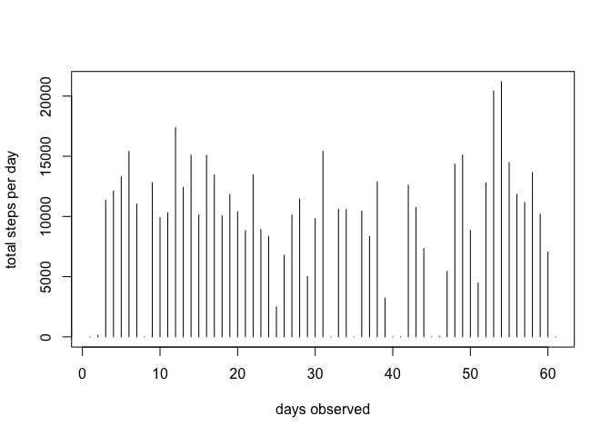
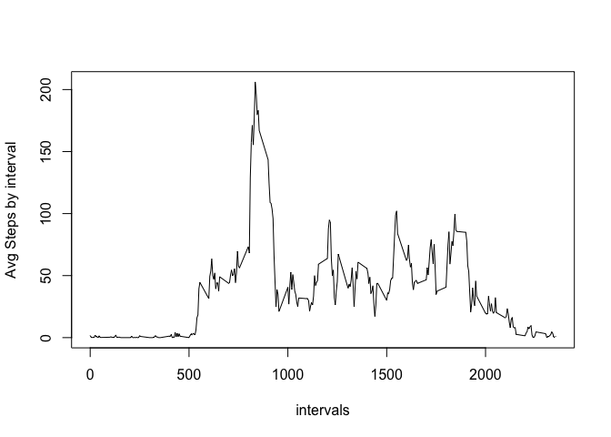
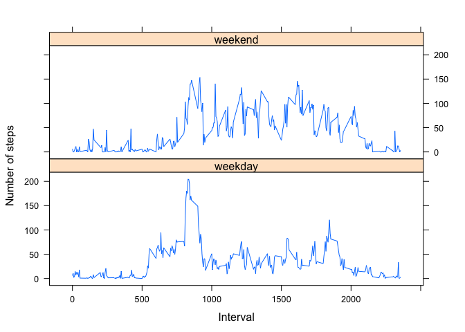

# Reproducible Research: Peer Assessment 1


## Loading and preprocessing the data

### 1. Setting up workspace

```r
# invisible(knitr::opts_knit$set(root.dir = './Desktop/code/reproducible_research'))
# if(!file.exists('./data')) dir.create('./data')
```

### 2. Download & Read data
### 3. Preprocess- convert 'date' column to POSIXlt

```r
download.file(destfile = './data/wearables.zip',
              'https://d396qusza40orc.cloudfront.net/repdata%2Fdata%2Factivity.zip')
unzip('./data/wearables.zip', exdir = './data')
file.remove('./data/wearables.zip')
```

```
## [1] TRUE
```

```r
dat <- read.csv('./data/activity.csv')
dat$dt <- as.POSIXlt.date(dat$date)
```


## What is mean total number of steps taken per day?
### 1. Histogram 

```r
tmp <- split(dat$steps, dat$date)
stepcount_by_date <- sapply(tmp, sum, na.rm=T)
plot(stepcount_by_date, type='h', 
     ylab='total steps per day', xlab ='days observed')
```

<!-- -->

### 2. Mean & median steps
There are two approaches here: to either take mean and median over all days, or to have vectors of mean and median. Both have been worked out below

Mean & Median vectors (first 6 values shown)

```r
mean_stepcount_by_date <- sapply(tmp, mean, na.rm=T)
median_stepcount_by_date <- sapply(tmp, median, na.rm=T)
head(mean_stepcount_by_date)
```

```
## 2012-10-01 2012-10-02 2012-10-03 2012-10-04 2012-10-05 2012-10-06 
##        NaN    0.43750   39.41667   42.06944   46.15972   53.54167
```

```r
head(median_stepcount_by_date)
```

```
## 2012-10-01 2012-10-02 2012-10-03 2012-10-04 2012-10-05 2012-10-06 
##         NA          0          0          0          0          0
```

Cumulative Mean & Median

```r
summary(stepcount_by_date)[4:3]
```

```
##   Mean Median 
##   9354  10400
```


## What is the average daily activity pattern?

### 1. Make a time series plot (i.e. type = "l") of the 5-minute interval (x-axis) and the average number of steps taken, averaged across all days (y-axis)


```r
tmp2 <- split(dat$steps, dat$interval)
mean_stepcount_by_interval <- sapply(tmp2, mean, na.rm=T)
plot(unique(dat$interval), mean_stepcount_by_interval, type='l', 
     xlab = 'intervals', ylab = 'Avg Steps by interval')
```

<!-- -->

### 2. Which 5-minute interval, on average across all the days in the dataset, contains the maximum number of steps?

```r
names(which.max(mean_stepcount_by_interval))
```

```
## [1] "835"
```


## Imputing missing values

### 1. Calculate and report the total number of missing values in the dataset (i.e. the total number of rows with 𝙽𝙰s)
TODO: complete cases is betetr way to do this but it errors out with POSIXlt column

```r
summary(dat$steps)[7]
```

```
## NA's 
## 2304
```

### 2. Devise a strategy for filling in all of the missing values in the dataset. The strategy does not need to be sophisticated. For example, you could use the mean/median for that day, or the mean for that 5-minute interval, etc.
Package used: Hmisc
Multiple techniques of imputing missing values include basic ones like replacing missing value with mean or sample from distribution, and advanced like knnImpute
Here, Random sample has been used to replace empty values as it does not have any side effects on data distribution.
We could have chosen to replace by mean but it is too sensitive to extreme values
Also, median in this case is 0, so it adds no new information.

```r
library(Hmisc)
```

```
## Loading required package: lattice
```

```
## Loading required package: survival
```

```
## Loading required package: Formula
```

```
## Loading required package: ggplot2
```

```
## 
## This data.table install has not detected OpenMP support. It will work but slower in single threaded mode.
```

```
## 
## Attaching package: 'Hmisc'
```

```
## The following objects are masked from 'package:base':
## 
##     format.pval, round.POSIXt, trunc.POSIXt, units
```

```r
dat$imp_steps <- with(dat, impute(steps, 'random'))
```

### 3. Create a new dataset that is equal to the original dataset but with the missing data filled in.

```r
dat2 <- dat[,-1]
names(dat2)[4] <- 'steps'
```

### 4. a. Make a histogram of the total number of steps taken each day  


```r
tmp3 <- split(dat2$steps, dat2$date)
stepcount_by_date_2 <- sapply(tmp, sum, na.rm=T)
plot(stepcount_by_date_2, type='h', 
     ylab='total steps per day', xlab ='days observed')
```

<!-- -->

### 4. b. Calculate and report the mean and median total number of steps taken per day.


```r
summary(stepcount_by_date_2)[4:3]
```

```
##   Mean Median 
##   9354  10400
```

### 4. c.  Do these values differ from the estimates from the first part of the assignment?

No they don't this is expected since we chose random sampling. Thus imputation has no statistical impact except on histogram


## Are there differences in activity patterns between weekdays and weekends?

### 1. Create a new factor variable in the dataset with two levels -- "weekday" and "weekend" indicating whether a given date is a weekday or weekend day.


```r
dat2$wday <- weekdays(dat2$dt, abbreviate = T)
dat2$facwday <- ifelse(dat2$wday == 'Sat' | dat2$wday == 'Sun',
                       'weekend','weekday') 
dat2$wday <- NULL
dat2$facwday <- as.factor(dat2$facwday)
```
### 2. Make a panel plot containing a time series plot (i.e. type = "l") of the 5-minute interval (x-axis) and the average number of steps taken, averaged across all weekday days or weekend days (y-axis). 


```r
mean_stepcount_by_interval_2 <- aggregate(steps ~ interval + facwday, 
                                          data = dat2, mean)
xyplot(steps ~ interval | facwday, mean_stepcount_by_interval_2, 
       type = "l", layout = c(1, 2), 
       xlab = "Interval", ylab = "Number of steps")
```

<!-- -->

Weekend steps are stread through the day but weekday steps only peak during the mornings.
